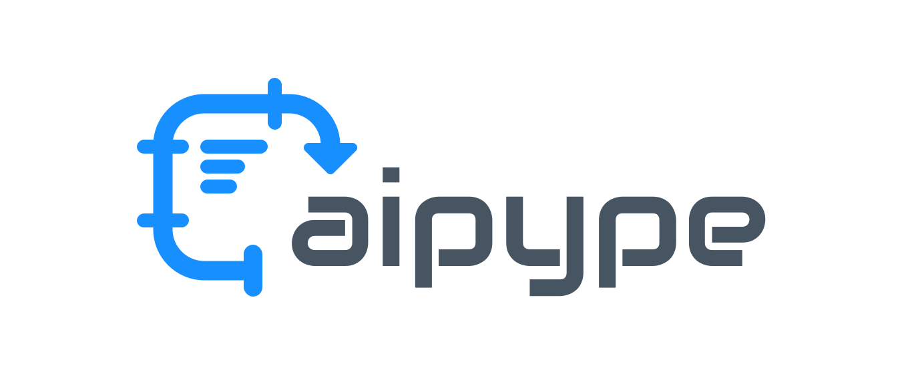

# aipype

<div align="center">
  

  [**Website**](https://mobisoftinfotech.com/tools/aipype/) | [**API Docs**](https://mobisoftinfotech.com/tools/aipype/docs/)
</div>

AI agent framework with declarative pipeline-based task orchestration.

`aipype` is mainly created for automation-heavy LLM-powered workflows. The aim is to create your agents as simple python scripts which you can write with the help of LLMs. 

### Like, Share and Subscribe :-)

This is a new project. So if you find the project useful, please give it a star on Github and help spread the word about it. 

## Status

**Alpha Release** - `aipype` is currently in Alpha stage. We are improving it rapidly and adding more reusable tasks. APIs may change between releases. 

## Examples

Here is a basic example of an agent which uses an LLM Task.

```python
import os

from typing import List, Optional
from typing import override
from aipype import PipelineAgent, BaseTask, LLMTask
from aipype import print_header


DEFAULT_TOPIC = "AI agent frameworks"

class OutlineAgent(PipelineAgent):
    """Agent that orchestrates a single `LLMTask` to create an article outline.

    - The agent reads `topic` from its `config` and passes it to the task.
    - The task uses a `prompt_template` with `${topic}` placeholder.
    - Provider is `ollama` and model is `gemma3:4b` for local inference.
    """

    @override
    def setup_tasks(self) -> List[BaseTask]:
        topic = self.config.get("topic", DEFAULT_TOPIC)

        return [self._create_outline_task(topic)]

    def _create_outline_task(self, topic: str) -> LLMTask:
        return LLMTask(
            name="outline_article",
            config={
                # Required provider + model for LLMTask
                "llm_provider": "ollama",
                "llm_model": "gemma3:4b",
                # API base is read from env var OLLAMA_API_BASE (see header notes)
                # Prompt templating: `${topic}` will be resolved from this config
                "prompt_template": (
                    "Create a concise, hierarchical outline for an article about ${topic}.\n"
                    "- Use 5-7 top-level sections with clear headings.\n"
                    "- Add 2-3 bullet points under each section.\n"
                    "- Optimize for technical readers and clarity.\n"
                    "Return the outline in markdown. Return only the outline, "
                    "no other text."
                ),
                # Optional steering signals
                "context": (
                    "You are an expert technical editor who creates clear, useful article outlines."
                ),
                "role": "Senior tech editor",
                # Sampling and length
                "temperature": 0.2,
                "max_tokens": 800,
                # Template variables
                "topic": topic,
            },
        )

    @override
    def display_results(self, sections: Optional[List[str]] = None) -> None:
        """Display formatted outline after pipeline execution using framework utilities."""
        # Use the framework's built-in display method for basic results
        super().display_results()

        # Add custom content display using framework utilities - true one-liner!
        self.context.display_result_content(
            "outline_article", "GENERATED OUTLINE (MARKDOWN)"
        )


if __name__ == "__main__":
    print_header("LLM TASK TUTORIAL - OUTLINE GENERATION")

    # Pick a topic; you can also pass this via CLI args or env in real usage
    topic = os.getenv("OUTLINE_TOPIC", DEFAULT_TOPIC)

    # Instantiate, run, and display results like the example agent does
    agent = OutlineAgent(name="outline-agent", config={"topic": topic})
    agent.run()
    agent.display_results()

```

For more details, check the following:

* Minimal Tutorial: `packages/aipype-examples/src/aipype_examples/tutorial`
* Examples: `packages/aipype-examples/src/aipype_examples/examples`


## Installation

```bash
# Core framework
pip install aipype

# With extras
pip install aipype aipype-extras

# With Google integrations
pip install aipype aipype-g
```

## Development Setup

```bash
# Install dependencies
uv sync --group dev

# Install pyright for type checking (requires Node.js)
npm install -g pyright
```

## Development Tools

### Code Formatting and Linting (ruff)

```bash
# Quick script (formats and lints all packages)
./scripts/run_ruff.sh

# Manual commands
ruff format packages/                    # Format code
ruff check packages/                     # Lint code
ruff check packages/ --fix              # Auto-fix issues
ruff format packages/aipype/           # Format specific package
```

### Type Checking (pyright)

```bash
# Quick script (checks all packages)
./scripts/run_type_checks.sh

# New unified type checker
python scripts/check_types.py                           # Check all packages
python scripts/check_types.py --package aipype        # Check specific package
python scripts/check_types.py --package aipype-extras # Check extras package
python scripts/check_types.py --summary                 # Show only summary
```

### Testing

```bash
# Quick scripts
./scripts/run_tests.sh                   # Unit tests only (default)
./scripts/run_tests.sh --all             # Unit + integration tests
./scripts/run_tests.sh --integration     # Integration tests only
./scripts/run_tests.sh --verbose         # Verbose output
./scripts/run_tests.sh --help            # Show all options

# Manual testing commands
uv run pytest packages/aipype/tests/ -v              # Unit tests for core
uv run pytest packages/aipype/integration_tests/ -v  # Integration tests
uv run pytest packages/aipype-extras/tests/ -v       # Test specific package
uv run pytest -k "test_specific_function" -v           # Run specific tests
```

### Complete Development Workflow

```bash
# Before committing changes, run all checks:
./scripts/run_ruff.sh && ./scripts/run_type_checks.sh && ./scripts/run_tests.sh --all
```

## Environment Variables

⚠️ **Security Note**: Never commit API keys or credentials to version control. Use `.env` files (which are gitignored) or environment variables for sensitive data.

```bash
# LLM Providers
export OPENAI_API_KEY=sk-your-key-here
export OPENAI_API_BASE=https://api.openai.com/v1  # Optional
export GEMINI_API_KEY=your-key-here
export OLLAMA_API_BASE=http://localhost:11434

# Search
export SERPER_API_KEY=your-serper-key-here

# Google APIs
export GOOGLE_CREDENTIALS_FILE=path/to/google_credentials.json
export TEST_EMAIL_RECIPIENT=your-email@gmail.com
```

## Contributing

We welcome contributions! Please follow these guidelines to ensure code quality and consistency.

### Code Quality Requirements

**All contributions must pass these checks before being merged:**

1. **Code Formatting**: Code must be formatted with ruff
2. **Linting**: Code must pass ruff linting checks
3. **Type Checking**: Code must pass pyright type checking
4. **Testing**: All new code must have comprehensive tests

### Development Workflow

1. **Fork and clone** the repository
2. **Set up development environment**:
   ```bash
   uv sync --group dev
   npm install -g pyright
   ```

3. **Make your changes** following the coding standards
4. **Write tests** for any new functionality
5. **Run all quality checks**:
   ```bash
   # This must pass without errors:
   ./scripts/run_ruff.sh && ./scripts/run_type_checks.sh && ./scripts/run_tests.sh --all
   ```

6. **Commit and push** your changes
7. **Submit a pull request** with a clear description

### Code Style Guidelines

- **Type Annotations**: All functions must have complete type annotations
- **Error Handling**: Use `TaskResult.success()` and `TaskResult.failure()` pattern for operational errors
- **Documentation**: Add docstrings for all public functions and classes
- **Testing**: Write both unit tests (with mocks) and integration tests (no mocks)

### Testing Requirements

- **Unit Tests**: Test individual functions/classes with mocks for external dependencies
- **Integration Tests**: Test real functionality end-to-end without mocks
- **Coverage**: Aim for high test coverage on new code
- **Test Organization**: Place tests in appropriate `tests/` or `integration_tests/` directories

### Pull Request Guidelines

- **Clear Description**: Explain what your PR does and why
- **Small Changes**: Keep PRs focused and reasonably sized
- **Update Documentation**: Update README/docstrings if needed
- **Quality Checks**: Ensure all automated checks pass
- **Examples**: Add examples for new features when appropriate

## Google APIs Integration Tests

Integration tests for Google APIs (Gmail, Sheets) need OAuth2 authentication.

### Prerequisites

#### Google Cloud Console Setup
1. Create project at [console.cloud.google.com](https://console.cloud.google.com/)
2. Enable Gmail/Sheets APIs
3. Configure OAuth consent screen (External type)
4. Create OAuth client ID (Desktop application)
5. Download credentials JSON and save as `google_credentials.json` in the project root dir

#### First-Time Authentication
Tests will open browser for OAuth2 consent and save tokens automatically.

## Publishing Releases

### For Maintainers

Publish to production PyPI:

```bash
export UV_PUBLISH_TOKEN=your-token-here
./scripts/publish_to_pypi.sh --prod
```

Verify published packages:

```bash
./scripts/create_test_project.sh /tmp/verify-release
```

## Creators

`aipype` is created by [Mobisoft Infotech](https://mobisoftinfotech.com/).

## License

This project is distributed under MIT License. So you can use it in your open source as well as commercial projects as you see fit. However, if you are doing something cool with it, we would really appreciate it if you let us know about it at: info@mobisoftinfotech.com
